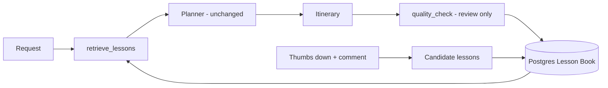

# Self-Improvement Loop

Northline improves through a controlled feedback and learning loop. It **never rewrites its own code, prompts or itineraries**.



## How it works
1. **Before planning:** `retrieve_lessons` loads medium/high-confidence lessons (ranked by destination, category, confidence and recency) into `memory_context`. The user's explicit request still wins on conflict.
2. **After planning:** `quality_check` reviews the itinerary and returns structured findings (`problem`, `reason`, `suggested_lesson`, `category`, evidence). Findings merge into existing lessons or create new low-confidence ones. The user always sees the original planner output.
3. **Feedback:** Thumbs down (comment required) → attached to the LangSmith `run_id` → candidate lesson + draft regression test in `evals/datasets/proposed/`. Thumbs up is logged as a positive event.
4. **Audit:** The chat UI shows a read-only **Improvement audit**: lessons loaded, problems found, lessons created/updated. Events are stored in Postgres (`improvement_events`).

## Confidence rules
| Observations | Confidence | Used in planning? |
|--------------|------------|-------------------|
| 1 | 0.20 (low) | No |
| 2 | 0.35 (low) | No |
| 3–5 | 0.65 (medium) | Yes |
| 6+ | 0.90 (high) | Yes |

Similar lessons in a category merge; evidence is append-only. Feedback candidates promote after **3** similar reports (`PROMOTION_THRESHOLD` in `lessons/policy.py`).

## Why this design
- **Predictable:** the planner stays a black box; learning happens around it.
- **Robust:** one bad rating can't change behavior — lessons need repeated evidence.
- **Two tracks:** the Lesson Book learns reusable itinerary wisdom ("max 5 attractions per day"); draft eval cases help developers fix real bugs.
- **Mem0 vs Lesson Book:** Mem0 holds *personal* facts ("I'm vegan"); the Lesson Book holds *general* guidance for all users.
- **Human in control:** a person must approve moving drafts into `golden_*.json` (via `/admin`), and any prompt, graph, tool or guardrail change.

## Key files
| Area | Files |
|------|-------|
| Schema + repository | `backend/lessons/schema.py`, `repository.py` |
| Confidence + merge policy | `backend/lessons/policy.py` |
| Reviewer | `backend/lessons/reviewer.py`, `backend/graph/nodes/quality_check.py` |
| Retrieval | `backend/graph/nodes/retrieve_lessons.py` |
| Service facade | `backend/lessons/service.py` |

## Commands (from `backend/`)
```powershell
python -m evals.helpers.trace_to_golden --collect-negative                     # all new negative traces
python -m evals.helpers.trace_to_golden --run-id RUN_ID --comment "Ignored my budget"   # one trace
python -m pytest evals/test_ci.py tests -q                                       # local checks
```
